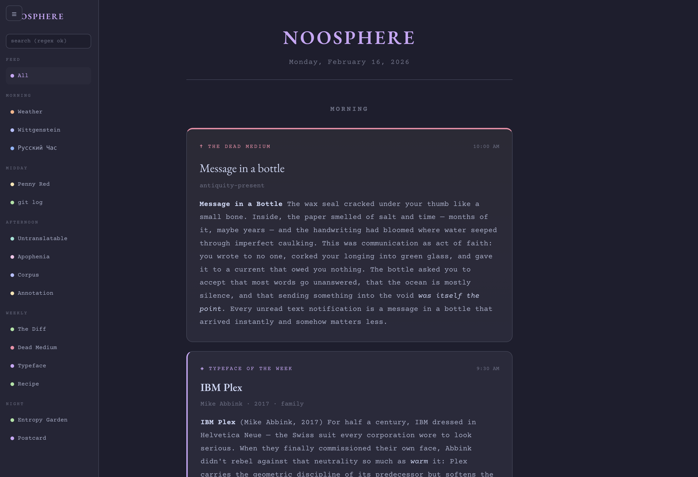

# Noosphere

A personal content feed — your own private social media timeline, populated by automated content generators that match your interests. No algorithms optimizing for engagement, no ads, no other people's opinions. Just a daily stream of things worth reading.

Named after [Vernadsky's concept](https://en.wikipedia.org/wiki/Noosphere) of the sphere of human thought.



## What It Is

Noosphere is a self-hosted PWA that aggregates 15 independent content streams into a scrollable timeline. Each stream is a Python script that generates one feed card per day (or per week), drawing from real data sources and using an LLM for commentary. Cards accumulate over time — scroll down to see yesterday's, last week's.

Think of it as RSS meets social media meets a curated zine, generated fresh every morning.

## The 15 Streams

| Stream | Cadence | Source |
|--------|---------|--------|
| ☁ **Lyrical Weather** | Daily | Live weather API + LLM prose |
| ◇ **Wittgenstein's Ladder** | Daily | All 513 Tractatus propositions, sequential |
| 🇷🇺 **Русский Час** | Daily | 122 curated Russian literary sentences + morphological analysis |
| ✦ **The Untranslatable** | 3x/week | 50 untranslatable words from ~15 languages |
| ⟐ **Corpus Surprise** | Daily | Random sentence from 130K real corpus sentences (13 languages) |
| ✎ **Annotation Layer** | Weekly | 566 real passages from 20 Project Gutenberg novels + margin notes |
| ⌬ **Entropy Garden** | Daily | Live generative art (DLA, flow fields, cellular automata, Game of Life) |
| ⟁ **Apophenia Machine** | 2x/week | Two unrelated things juxtaposed — Wikipedia + arxiv + poems + history |
| ✝ **The Dead Medium** | Weekly | 61 defunct communication technologies with elegies |
| 🌙 **Midnight Postcard** | Daily | A single atmospheric photograph from Unsplash, no caption |
| $ **git log --oneline** | Daily | Recent commits from 30+ watched open-source repos |
| 📍 **The Penny Red** | 2x/week | 46 renamed/erased/contested places with toponymic analysis |
| ⟺ **The Diff** | Weekly | Same passage in 2-3 languages, side by side, with translation analysis |
| ◈ **Typeface of the Week** | Weekly | 32 historically interesting typefaces with stories |
| 🍳 **Recipe** | Weekly | Real recipe from TheMealDB + etymology of a key ingredient |

## Data Sources

All content is sourced from real, open data:

- **Leipzig Corpora Collection** — 130,000 sentences across English, Russian, French, Spanish, German, Japanese, Arabic, Turkish, Portuguese, Italian, Polish, Chinese
- **Project Gutenberg** — 513 Tractatus propositions, 566 literary passages from 20 novels (Austen to Pynchon)
- **TheMealDB** — Real recipes with photos and ingredient lists
- **Unsplash API** — Atmospheric photographs with proper attribution
- **GitHub API** — Live commit feeds from watched repositories
- **wttr.in** — Weather data

LLM commentary is generated via any OpenAI-compatible API endpoint (Claude, GPT, local models, etc.).

## Discord Cross-Posting

Noosphere can automatically cross-post feed items to a Discord channel. When a generator writes a new card, `utils.py` formats it for Discord (with type-specific emoji labels and markdown) and posts via the Discord Bot API.

To enable:
1. Set `NOOSPHERE_DISCORD_CHANNEL` in your `.env` to your target channel ID
2. Configure a Discord bot token accessible to the generators (via OpenClaw config or `DISCORD_BOT_TOKEN` env var)

If no Discord credentials are found, cross-posting is silently skipped — feed generation is never blocked.

## Architecture

```
┌─────────────────────────────────────┐
│         noosphere (Express)          │
│         serves /api/feed             │
│         reads JSON from feed/        │
├─────────────────────────────────────┤
│        public/index.html             │
│        PWA frontend                  │
│        15 card type renderers        │
│        Catppuccin Mocha theme        │
│        service worker + offline      │
├─────────────────────────────────────┤
│        generators/                   │
│        15 Python scripts             │
│        run daily via cron            │
│        each writes one JSON to feed/ │
│        schedule.py controls cadence  │
└─────────────────────────────────────┘
```

Each generator is **idempotent** — it checks if today's card already exists before generating. Safe to re-run.

Each generator that uses curated content has **state tracking** — sequential index or used-set with automatic reset when exhausted.

## Setup

### Prerequisites

- Node.js 18+
- Python 3.8+
- An OpenAI-compatible API endpoint (for LLM commentary)
- Optional: Unsplash API key (for Midnight Postcard)

### Installation

```bash
git clone https://github.com/yourusername/noosphere.git
cd noosphere
npm install

# Configure your LLM endpoint
cp .env.example .env
# Edit .env with your API details

# Create feed directory
mkdir -p feed

# Generate today's content
cd generators && bash run_all.sh

# Start the server
node server.js
# → http://localhost:7701
```

### Configuration

Create a `.env` file:

```bash
# LLM API (any OpenAI-compatible endpoint)
LLM_API_URL=http://localhost:8080/v1/chat/completions
LLM_API_KEY=your-api-key
LLM_MODEL=claude-sonnet-4-20250514

# Optional: Unsplash API (for Midnight Postcard)
UNSPLASH_ACCESS_KEY=your-key

# Optional: customize which repos git log watches
# Edit generators/git_log.py REPOS list
```

### Adapting to Your Interests

The generators are designed to be swapped, edited, or replaced:

- **Don't speak Russian?** Replace `russian.py` with sentences from any language in the Leipzig collection. Download corpora from [wortschatz.uni-leipzig.de](https://wortschatz.uni-leipzig.de/en/download).
- **Different reading taste?** Edit `data/literary-passages.json` or run the Gutenberg extraction script on your favorite books.
- **Watch different repos?** Edit the `REPOS` list in `git_log.py`.
- **Different places?** Edit the `PLACES` list in `penny_red.py`.
- **Different typefaces?** Edit the `TYPEFACES` list in `typeface.py`.
- **Don't want a stream?** Comment it out of `run_all.sh` and remove it from `schedule.py`.
- **Want a new stream?** Copy any generator as a template. The pattern is: pick data → call LLM for commentary → write JSON to `feed/`.

### Running as a Service

```bash
# systemd user service
cat > ~/.config/systemd/user/noosphere.service << EOF
[Unit]
Description=Noosphere Feed Server
After=network.target

[Service]
Type=simple
WorkingDirectory=/path/to/noosphere
ExecStart=/usr/bin/node server.js
Restart=always
RestartSec=5

[Install]
WantedBy=default.target
EOF

systemctl --user daemon-reload
systemctl --user enable --now noosphere
```

### Daily Generation

Set up a cron job or scheduled task to run generators daily:

```bash
# crontab -e
0 6 * * * cd /path/to/noosphere/generators && bash run_all.sh >> /var/log/noosphere-gen.log 2>&1
```

## Frontend

Single-page vanilla JS app. No framework, no build step.

- **Catppuccin Mocha** dark theme
- **Courier Prime** (body) + **EB Garamond** (headers)
- **15 distinct card types** with unique styling
- **Sidebar** for filtering by stream type and regex search
- **Entropy Garden** cards render live `<canvas>` animations (DLA frost crystals, flow fields, cellular automata, Game of Life)
- **PWA** with service worker for offline support and home screen install
- Auto-refreshes every 5 minutes

## Content Pool Sizes

| Pool | Items | Runway |
|------|-------|--------|
| Tractatus propositions | 513 | ~1.4 years daily |
| Russian sentences | 122 | ~4 months daily |
| Literary passages | 566 | ~11 years weekly |
| Corpus sentences | 130,000 | Effectively infinite |
| Untranslatable words | 50 | ~17 weeks at 3x/wk |
| Places (Penny Red) | 46 | ~23 weeks at 2x/wk |
| Dead media | 61 | ~61 weeks weekly |
| Parallel translations | 20 | ~20 weeks weekly |
| Typefaces | 32 | ~32 weeks weekly |
| Seasonal ingredients | 36 | ~9 months weekly |

A low-stock monitor in `run_all.sh` alerts when any pool drops below threshold.

## License

MIT

## Credits

- [Leipzig Corpora Collection](https://wortschatz.uni-leipzig.de/en/download) for multilingual sentence data
- [Project Gutenberg](https://gutenberg.org) for public domain literature
- [TheMealDB](https://themealdb.com) for recipe data
- [Unsplash](https://unsplash.com) for photographs
- [Catppuccin](https://catppuccin.com) for the color theme
- [Courier Prime](https://quoteunquoteapps.com/courierprime/) and [EB Garamond](http://www.georgduffner.at/ebgaramond/) for typography
